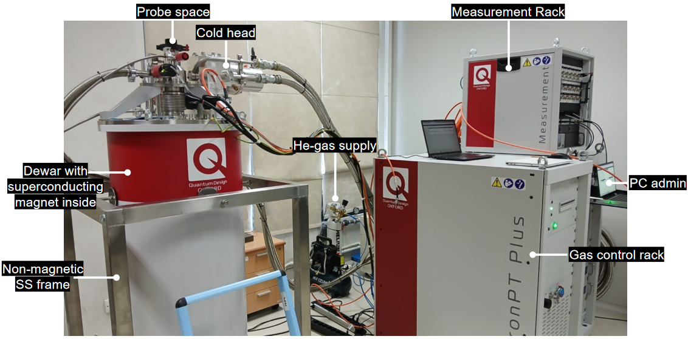

# Instruments

Documentation and manuals for the available instruments used in Qudev experimental research.

## 1.5 K Variable Temperature Insert Teslatron PT Plus with 8 Tesla Superconducting Magnet

Lowering an object’s temperature down to 1 Kelvin (or a mili-Kelvin for that matters) is like launching a rocket into space: it is a multi-step process, where each step reaches a certain height and requires a different engine to operate. Here we provide you a hitch-hike guide to cooldown a sample down to 1.5 Kelvin from room temperature, learn how to energize a superconducting magnet safely, play with the temperature and other instruments to measure electrical conductivity (down the rabbit hole!)

  
*Figure 1. 1.6 K Variable Temperature Insert Perspective View*
