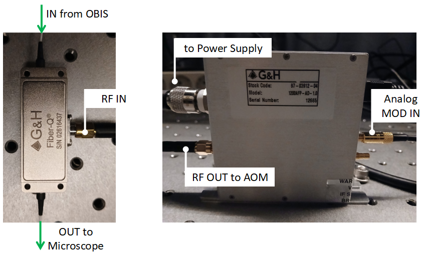

### OBIS LS Laser

 
*Figure 1. OBIS Laser.*

⚠️WARNING: Ensure beam path is safe and goggles are worn before turning the laser ON

The laser unit is already assembled and, by default, fiber-connected to the G&H AOM. The laser will output 532 nm green beam with vertically polarized light (100:1 ratio).

To power up the laser, turn on the OBIS power supply. At this point, you will hear noise from the cooling fan. Please wait for the laser’s status LED to turn green (ready state). Enable the laser by switching the key to the “ON” position. If using USB control, connect the laser to a computer and open the OBIS GUI software (available from Coherent). The laser intensity can be tuned remotely from 1 to 20 mW.

### Acoustic Opto Modulator (AOM)

 
*Figure 2. AOM and RF Driver.*

The OBIS LS laser is modulated by a G&H Fiber-Coupled Acousto-Optic Modulator (Fiber-Q® 532 nm, 200 MHz). The AOM is driven by a 3910 series RF driver.

First connect the RF output to the AO modulator with an SMA jack connector. The RF output impedance is 50 ohms. ⚠️ Always connect the RF output to an AO device (or a 50 Ohm load) prior to connecting power to the driver. Fail to do so might damage the driver!

Next, power the driver using a LeCroy power supply placed nearby. Connect the power supply to the driver using a special BNC cable. Set the voltage to 24 V, and then turn the voltage ON. If the green LED on the rear panel of the driver turns ON, it indicates that the driver is activated and the voltage is being properly supplied. If not, you need to increase the voltage. The 3910 drivers will run on voltages from +24 V - +28 V.

Next, connect the analog modulation port to a dedicated function generator (WF1973). This port uses an SMB jack connector and accepts a 0–1 V input signal with an input impedance of 50 Ω. The maximum RF output occurs at 1 V, while the minimum RF power corresponds to 0 V. The RF output power varies linearly with the input voltage between 0 and 1 V.

### Mini-Circuit RF Power Amplifier (Model ZHL-16W-43-S+)

 
*Figure 3. Power Amplifier.*

The Mini-Circuits ZHL-16W-43-S+ is a broadband, high-power RF amplifier that operates from 1.8 to 4.0 GHz with up to +42 dB gain and a maximum output power of +42 dBm (≈16 W).

The amplifier is used to boost the RF power delivered to a microwave antenna/coil. The amplifier will run on voltages from +25V - + 30V and draw about 3A current (max. 4.3A)!. 
⚠️Be careful not to exceed the rated input drive level of +5 dBm max.

Connection Topology:

MW Generator  →  [INPUT SMA]  Amplifier  [OUTPUT SMA]  →  Microwave Antenna/Coil

