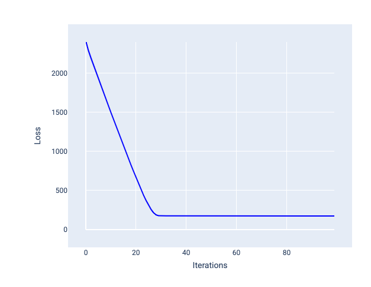
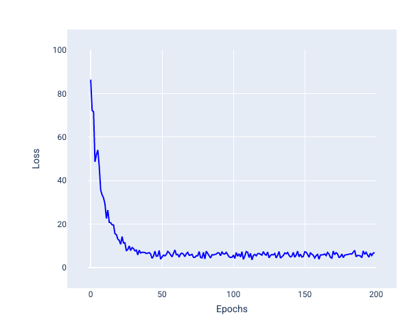

# Tutorial: Materi Pembelajaran Machine Learning

## Daftar Isi
  [*Introdcution*](#introduction)
1. Model Machine Learning
    - [Regresi Linear *(Linear Regression)*](#11-regresi-linear-linear-regression)
        - [Loss](#loss)
        - [Hyperparameters](#hyperparameters)
    - [Regresi Logistik *(Logistic Regression)*](#regresi-logistik-logistic-regression)
    - [Klasifikasi *(Classification)*](#klasifikasi-classification)
2. Data
    - [Data Numerik *(Numerical Data)*](#regresi-linear)
    - [Data Terkategori *(Categorical Data)*](#loss)
    - [Dataset, Generalisasi, dan *Overfitting*](#dataset-generalisasi-overfitting)
3. Model Machine Learning Tingkat Lanjut
    - [Jaringan Saraf *(Neural Networks)*](#artificial-neural-network)
    - [Embeddings](#embeddings)
    - [Large Language Models (LLMs)](#large-language-models)
4. Penerapan Machine Learning di Dunia Nyata
    - [Pembuatan Sistem Machine Learning](#pembuatan-sistem-machine-learning)
    - [Automasi dengan Machine Learning](#loss)
    - [Keadilan dalam Sistem AI *(Fairness)*](#keadilan-dalam-sistem-ai)

## *Introduction*
### Apa itu Machine Learning?
Machine Learning (ML) adalah proses dari pengembangan suatu *model* yang digunakan untuk melakukan prediksi atau menghasilkan konten (teks, gambar, video maupun audio) berdasarkan data yang diberikan. *Model* itu sendiri merupakan suatu sistem ML yang memanfaatkan relasi matematis dari suatu data untuk membuat prediksi data baru ataupun membuat konten.

Beberapa kategori ML berdasarkan bagaimana suatu sistem membuat prediksi ataupun konten, yaitu:
1. Supervised Learning
2. Unsupervised Learning
3. Reinforcement Learning
4. Generative AI

### Supervised Learning
Supervised Learning adalah *model* ML yang dilatih menggunakan data yang diberikan beserta label atau jawaban yang benar. Hal ini bertujuan agar *model* dapat berkembang terus-menerus, sehingga *model* tersebut dapat menjadi lebih akurat. Penggunaan umum Supervised Learning yaitu pada regresi dan klasifikasi.
*Model* regresi bertujuan untuk memprediksi suatu nilai, seperti harga, waktu, suhu, dll. Sedangkan *model* klasifikasi bertujuan untuk menentukan kategori atau kelas dari suatu data, seperti klasifikasi rendah atau tingginya harga ataupun klasifikasi email sebagai spam atau bukan spam.

### Unsupervised Learning
Unsupervised Learning adalah *model* yang dilatih menggunakan data tanpa label atau jawaban yang benar. Tujuannya agar *model* dapat mengidentifikasi suatu pola atau keterkaitan dari data. Umumnya menggunakan metode *clustering*, dimana suatu data dengan pola yang sama akan dikelompokkan ke dalam satu kategori atau *cluster*. Salah satu penerapannya adalah analisis data *user* di suatu website, dimana sistem dapat mengelompokkan *user* berdasarkan perilaku mereka tanpa perlu mengetahui tipe *user* sebelumnya.

### Reinforcement Learning
Reinforcement Learning adalah *model* yang dilatih dengan sistem *Rewards or Punishments* berdasarkan aksi yang dilakukan. Sistem ini akan membuat kebijakan yang dapat menetapkan strategi efisien untuk mendapatkan *reward* terbanyak.

### Generative AI
Generative AI adalah *model* yang membuat konten dari *user input*. Contohnya pembuatan gambar, komposisi musik, merangkum teks, penjelasan, kode, dll. *Model* ini mengambil variasi *input* dan menghasilkan variasi *output*. *Input* juga dapat dikombinasikan seperti mengambil *input* gambar untuk menghasilkan *output* gambar dan teks. *Generative model* belajar dari pola-pola dalam data dengan tujuan untuk menghasilkan data baru yang mirip.

Untuk membuat *output* yang unik dan kreatif, *generative model* dilatih terlebih dahulu menggunakan unsupervised learning untuk meniru data yang dilatih. Lalu dilatih lebih lanjut menggunakan supervised learning atau reinforcement learning pada data tertentu yang kemungkinan akan berhubungan dengan tugas yang diberikan.

---

## 1. Model Machine Learning
### 1.1 Regresi Linear *(Linear Regression)*
Regresi Linear *(Linear Regression)* merupakan salah satu teknik dalam statistika yang digunakan untuk mencari hubungan antar variabel. Dalam Machine Learning, regresi linear digunakan untuk mencari hubungan antara fitur *(features)* dan label.

Sebagai contoh jika kita ingin memprediksi efisiensi bahan bakar mobil dalam satuan *miles per gallon* yang berdasarkan pada berat kendaraan dalam satuan pounds 

|   Berat Mobil (pounds)   |   Jarak Tempuh (Miles/Gallon)   |
|:---------------------:|:---------------------:|
|         3.5          |          18           |
|         3.69          |         15           |
|         3.44          |         18           |
|         3.43          |         16           |
|         4.34          |         15           |
|         4.42          |         14           |
|         2.37          |         24          |

Jika data tersebut di plot maka hasilnya akan sebagai berikut :
.png)
Dengan data yang telah di plot kita dapat membuat model prediksi sederhana dengan regresi linear. Kita dapat menggambar lurus yang cocok dengan sebaran titik-titik data yang ada

Regresi Linear memiliki persamaan yang dapat dirumuskan sebagai berikut :

$$
y = mx + b
$$
- y = jarak tempuh ( Nilai keluaran yang ingin diprediksi )
- *m* = kemiringan garis
- x = berat kendaraan ( Nilai input )
- b = titik potong garis terhadap sumbu Y

Dalam ML persamaan untuk regresi linear dapat dituliskan sebagai berikut :

$$
y' = b + w1x1
$$

- y' = nilai label yang diprediksi ( Nilai keluaran )
- b = bias pada model. Bias merupakan titik potong terhadap sumbu y. Digunakan untuk membantu menyesuaikan model agar bisa fit dengan data asli
- w1 = berat pada nilai fitur. Memiliki konsep yang mirip dengan kemiringan garis (*slope*) untuk mengatur kemiringan.
- x1 = nilai fitur (Nilai Input)

Sebagai contoh apabila kita memiliki nilai bias sebesar 33.59 dan nilai *weight* adalah -4.57. Kita dapat membuat prediksi dengan model ini dengan memasukkan ke rumus regresi linear untuk ML :

$$
y' = 33.59 + (-4.57)(x1)
$$

Kita bisa memasukkan berat kendaraan untuk mendapatkan nilai jarak tempuh kendaraan. Sebagai contoh apabila kita memasukkan nilai 4,000 pound maka model ini memprediksi jarak tempuh kendaraan sebesar 15,31 miles/gallon.

Pada contoh diatas hanya menggunakan satu fitur saja yaitu berat dari mobil. Model dapat menjadi lebih akurat apabila menambahkan lebih dari satu fitur. Formula regresi linear dapat berubah menjadi :

$$
y' = b + w1x1 + w2x2 + ... + wnxn
$$

Dimana :
- x1, x2, ..., xn merupakan fitur-fitur tambahan (bisa berupa berat mobil, ukuran mesin, kecepatan maksimal, dll)
- w1, w2, ..., wn adalah bobot (*weight*) masing-masing fitur yang menentukan seberapa besar pengaruh fitur terhadap prediksi
- b adalah bias untuk menggeser garis prediksi

Dengan menggunakan beberapa fitur, model dapat menangkap lebih banyak informasi dari data sehingga hasil prediksi menjadi lebih relevan dan akurat. Pendekatan ini disebut sebagai regresi linear multivariat.

## Loss

**Loss** adalah angka yang mengukur seberapa buruk prediksi model terhadap data sebenarnya.  
Semakin kecil loss, semakin baik model memprediksi data.

---

### Cara Menghitung Loss

Rumus:

$$
Loss = (aktual - prediksi)^2
$$

#### Contoh:
Jika nilai aktual = 4, dan prediksi model = 5:

$$
Loss = (4 - 5)^2 = 1
$$

---

### Perbedaan Loss dan Error

| Istilah | Rumus | Penjelasan |
|--------|-------|------------|
| Error  | Aktual - Prediksi | Nilai selisih antara hasil prediksi dan nilai sebenarnya |
| Loss   | (Aktual - Prediksi)² | Kuadrat dari error agar selalu positif dan lebih sensitif terhadap kesalahan besar |

---

### Mean Squared Error (MSE)

**MSE** adalah rata-rata dari seluruh nilai **Loss** pada dataset.

$$ 
\text{MSE} = \frac{1}{n} \sum_{i=1}^{n} (y_i - \hat{y}_i)^2
$$

#### Keterangan:
- $y_i$ : Nilai aktual ke-i  
- $\hat{y}_i$ : Nilai prediksi ke-i  
- $n$ : Jumlah total data

---

## Hyperparameters
Berbeda dengan parameter yang dihitung oleh *model* saat latihan, hyperparameter adalah variabel yang dapat dikendalikan. Tiga hyperparameter yang umum, yaitu:
1. Learning rate
2. Batch size
3. Epochs

### Learning Rate
Learning rate merupakan nilai *float* yang dapat diatur untuk mempengaruhi kecepatan konvergensi suatu *model*. Jika learning rate suatu model terlalu rendah, konvergensi akan memakan waktu yang lama direnakan perubahan parameter terlalu kecil. Tetapi jika learning rate suatu model terlalu tinggi, parameter akan berubah terlalu besar dan menyebabkan fluktuasi yang mengakibatkan konvergensi tidak tercapai.

Learning rate yang ideal dapat membantu *model* untuk konvergensi dengan jumlah iterasi yang rasional. Maka dari itu tujuannya adalah untuk menentukan learning rate yang tidak terlalu tinggi atau terlalu rendah agar *model* dapat mencapai konvergensi dengan cepat. Berikut merupakan kurva loss dari contoh *model* yang berkembang secara signifikan di 20 iterasi awal sebelum berkonvergensi.

#### Batch Size
Batch size merujuk kepada jumlah data sampel yang diproses *model* sebelum memperbarui variabel *weights* dan *bias*. Dua teknik yang umum yaitu *stochastic gradient descent* and *mini-batch stochastic gradient descent*.
---
***Stochastic gradient descent* (SGD)**
Teknik ini hanya menggunakan satu contoh (ukuran *batch* adalah satu). Kata *"stochastic"* berarti contoh yang digunakan pada setiap *batch* terpilih secara acak. Teknik ini menghasilkan *noise* yang menyebabkan *loss* bertambah dibandingkan menurun seiring iterasi.

Dapat dilihat di kurva tersebut, *model* yang menggunakan *stochastic gradient descent* menghasilkan *noise* di seluruh kurva tidak hanya di dekat konvergensi.

***Mini-batch stochastic gradient descent* (mini-batch SGD)**
Untuk ***N*** jumlah poin data, *batch* batch akan berukuran lebih dari 1 dan kurang dari ***N***. *Model* memilih contoh-contohnya kedalam setiap batch secara acak, menghitung rata-rata gradien, lalu memperbarui *weights* dan *bias* sekali per iterasi.

---
Saat melatih *model*, beberapa *noise* dapat menjadi hal yang bermanfaat, terutama pada *neural network*.

---

## Bahan Bacaan
- [Dokumentasi Machine Learning](https://developers.google.com/machine-learning/crash-course)

---
*Kembali ke [Daftar Tutorial](https://github.com/BRIN-Q/tacit-knowledge)*